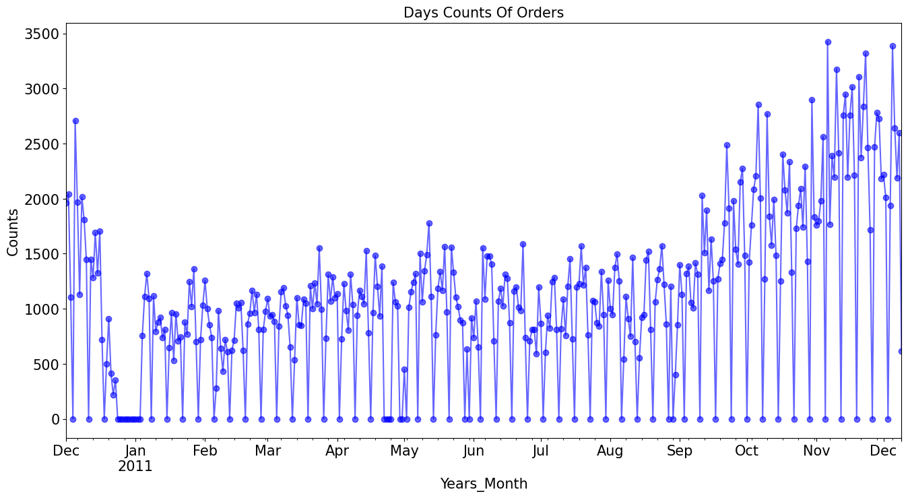
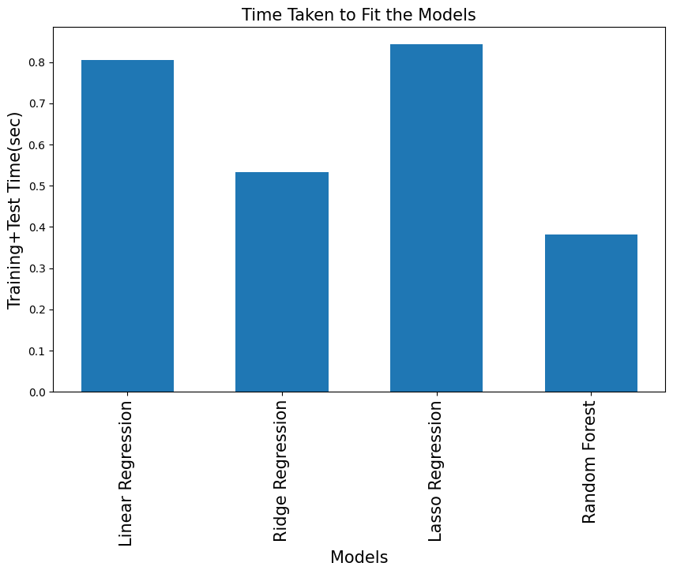

# E-Commerce Sales Prediction

A comprehensive project focused on predicting sales in an e-commerce context through data preprocessing, feature engineering, and data visualization.

## Description

This project aims to analyze and predict sales trends in an e-commerce dataset. It includes data preprocessing, feature engineering, and visualizing sales data to identify top-selling products.

## Features

- **Data Preprocessing & Cleaning**
  - Loads the dataset and removes entries with missing CustomerID.
  - Handles duplicate StockCode entries and encodes categorical variables using LabelEncoder.

- **Data Filtering**
  - Removes short StockCode values (less than 5 characters) and negative Quantity values indicating returns.

- **Feature Engineering**
  - Adds new columns: CancelledOrder, InternationalOrders, and computes Sales as Quantity * UnitPrice.

- **Visualization & Analysis**
  - Identifies and visualizes the top 10 products by sales using a bar chart for sales trend analysis.

## Installation Instructions

To set up the project locally:

```bash
# Clone the repository
git clone https://github.com/yourusername/E-Commerce-Sales-Prediction.git

# Navigate to the project directory
cd E-Commerce-Sales-Prediction

# Install required dependencies
pip install -r requirements.txt

# Ensure you have the dataset file (e.g., data.csv) in the data directory
```

## Usage

1. Run the script to process the data and generate visualizations:

```python
python sales_prediction.py
```

2. The script will generate a bar chart showing the top 10 products by sales.

## Technologies Used

- **Libraries:**
  - `pandas` for data manipulation
  - `numpy` for numerical operations
  - `matplotlib` and `seaborn` for data visualization
  - `scikit-learn` for machine learning tasks
  - `labelencoder` for categorical variable encoding

- **Tools:**
  - Python 3.x
  - Jupyter Notebook (optional for exploration)

## Contribution Guidelines

Contributions are welcome! Here's how you can contribute:

1. Fork the repository.
2. Create a new branch for your feature or bug fix.
3. Commit your changes with clear commit messages.
4. Push your branch to your forked repository.
5. Open a Pull Request against the main branch of this repository.

Please ensure any changes follow the existing code style and include tests if applicable.

## License

This project is licensed under the MIT License. See the [LICENSE](LICENSE) file for details.

```markdown
MIT License

Copyright (c) [Year] [Your Name]

Permission is hereby granted, free of charge, to any person obtaining a copy
of this software and associated documentation files (the "Software"), to deal
in the Software without restriction, including without limitation the rights
to use, copy, modify, merge, publish, distribute, sublicense, and/or sell
copies of the Software, and to permit persons to whom the Software is
furnished to do so, subject to the following conditions:

The above copyright notice and this permission notice shall be included in all
copies or substantial portions of the Software.

THE SOFTWARE IS PROVIDED "AS IS", WITHOUT WARRANTY OF ANY KIND, EXPRESS OR
IMPLIED, INCLUDING BUT NOT LIMITED TO THE WARRANTIES OF MERCHANTABILITY,
FITNESS FOR A PARTICULAR PURPOSE AND NONINFRINGEMENT. IN NO EVENT SHALL THE
AUTHORS OR COPYRIGHT HOLDERS BE LIABLE FOR ANY CLAIM, DAMAGES OR OTHER
LIABILITY, WHETHER IN AN ACTION OF CONTRACT, TORT OR OTHERWISE, ARISING FROM,
OUT OF OR IN CONNECTION WITH THE SOFTWARE OR THE USE OR OTHER DEALINGS IN THE
SOFTWARE.
```


Some Images from This Project




